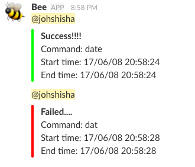

# Bee
お知らせ蜂bot  
slackに任意のコマンドの終了を可愛くお知らせしてくれる  
  

機械学習等の実行に時間のかかるプログラムを実行するときに利用するつもりで作成した  

### セットアップ
```
$ git clone https://github.com/johshisha/bee
$ cd bee
$ chmod 777 bee.sh
$ echo "alias bee=\"`pwd`/bee.sh\"" >> ~/.zshrc
$ source ~/.zshrc
```

bee.sh内の以下の設定を自分の好きなように変える
```
WEBHOOKURL="WebhockのURL入れてね"
#slack 送信チャンネル
CHANNEL=${CHANNEL:-"#general"}
#メッセージ
WEBMESSAGE="Command: ${COMMAND}\nStart time: ${start}\nEnd time: ${end}"
#メンションするユーザ
MENTION_USER="@channel"
```

### 使い方
```
$ bee $COMMAND
```
COMMANDは任意のコマンド

e.g.,
```
$ bee python train.py --epoch 50
```
